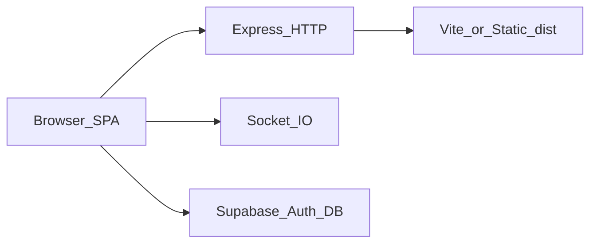

# Architecture

## High-level

One **Node.js process** serves:

1. **HTTP** — SPA HTML/JS/CSS (Vite dev middleware or static `dist`).
2. **WebSocket** — Socket.IO for room membership, drawing, cursors, moderation.

The browser talks to **Supabase** directly for Auth and Postgres (anon key + RLS).

## Frontend routing (`src/App.tsx`)

| Route | Condition | UI |
|-------|-----------|-----|
| `/auth` | No session | `Auth` |
| `/auth` | Session | Redirect `/` |
| `/` | Session | `Landing` |
| `/` | No session | Redirect `/auth` |
| `/room/:roomId` | Session | `Whiteboard` (`roomId` is `boards.room_code`) |
| `/room/:roomId` | No session | Redirect `/auth` |

Session is loaded with `supabase.auth.getSession()` and kept fresh via `onAuthStateChange`. If Supabase env vars are missing, `supabase` is `null` and auth flows show configuration errors.

## Main pages

- **Auth** — Email/password sign-up and sign-in; sign-up signs out immediately to force explicit sign-in.
- **Landing** — Profile from `profiles`, lists owned and joined `boards`, creates boards, joins by `room_code`, checks `participants.role !== banned` before navigation.
- **Whiteboard** — Resolves board by `room_code`, loads `board_elements` into Konva state, maintains `board_presence`, connects Socket.IO after board metadata is known, persists dirty canvas to Supabase on a debounced schedule, supports owner moderation (approve/reject, kick, ban) via sockets.

## Server (`server.ts`)

- **In-memory rooms** — `Map<roomId, RoomState>` with `online` and `pending` socket maps; not persisted across process restarts.
- **Cap** — `MAX_ROOM_USERS = 5` admitted sockets per room.
- **Join model** — Clients emit **`request-join`** with DB-derived flags (`isOwner`, `isApprovedMember`, `isBanned`, `participantRole`). Server admits, queues pending, or denies with reasons documented in [06-realtime-protocol.md](./06-realtime-protocol.md).
- **Relay** — Admitted sockets broadcast `draw`, `update`, `delete`, `clear`, `cursor` to peers in the same `roomId` (Socket.IO room).

## Whiteboard state

- **React state** — `elements`, tool/color/stroke, selection, remote `cursors`, `roomRoster`, `pendingRequests`, `drawingUsers`.
- **Refs** — Socket ref, dirty flag for Supabase persistence, element list ref for flush logic.

Shared TypeScript shapes live in [`src/types.ts`](../src/types.ts).
